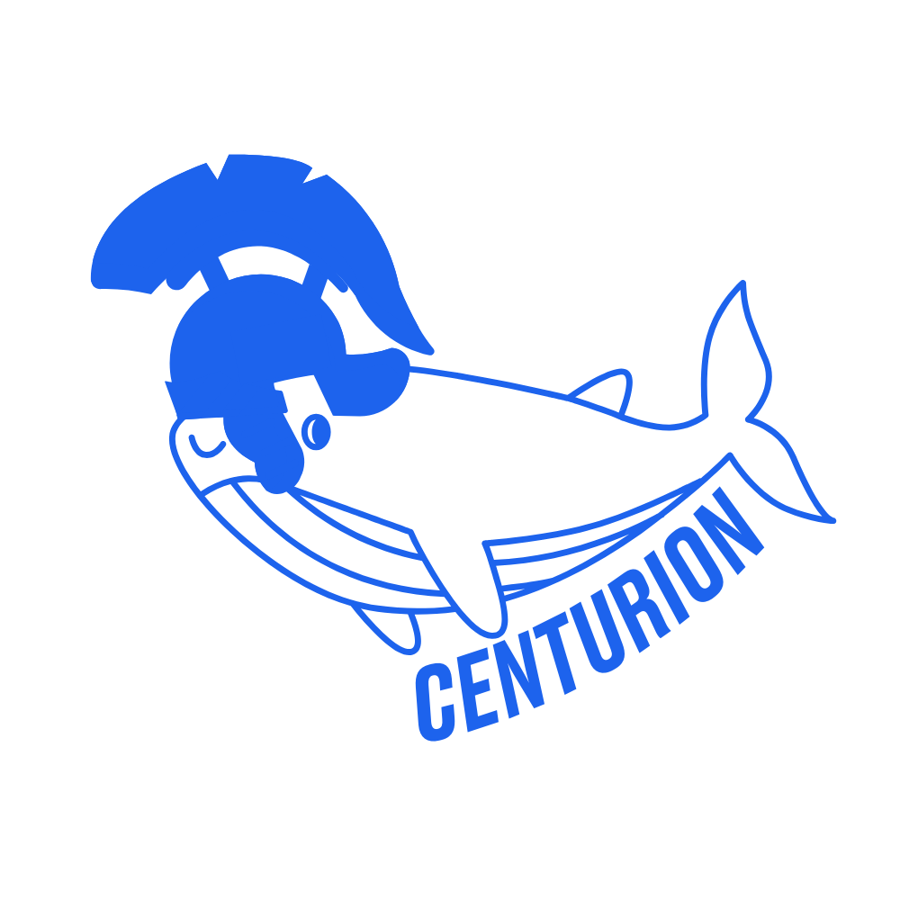

# Centurion

Centurion is a private hosting service offered by the Crossbone non-profit to its members. Since our goal is to simplify
learning all IT-related stuff and helping IT engineers in their career, this repository is made open-source except for
modules that are kept private as-per member requests.

Enjoy!

# Docker

This repository provides the centurion stack's Docker images. There ain't really anything to
say about it, is there ?

---

## Quickstart

TBD
